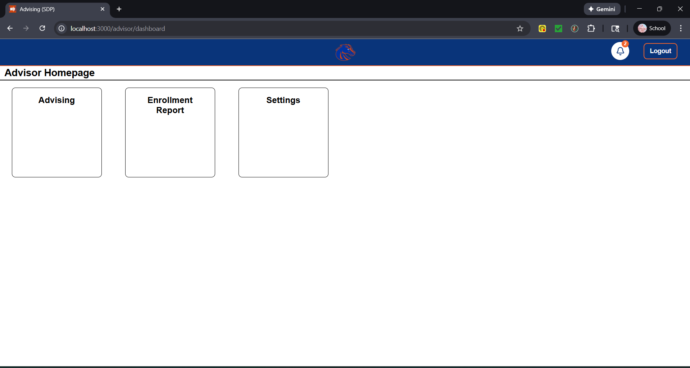
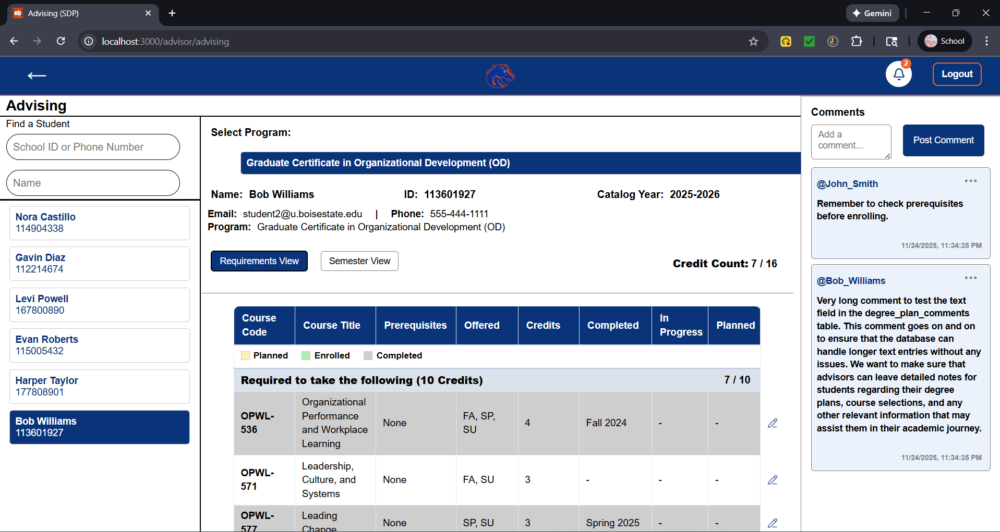

<nav>
  <a href="./index.md">Home</a> |
  <a href="./features.md">Features</a> |
</nav>

# Features
Below is a list of the main features we implemented in our project:

## User Login / Authentication
* Secure login with hashed passwords

* Supports multiple roles per user
* UI adapts based on active role

---

## Degree Tracking
* Students can view own plans and communicate via a comment section
* Students are alerted of course overlaps with certificates they can apply for

* Advisors can view plans for all students in caseload with search section and communicate via a comment section
* Advisors can manage plans and update status for courses as well as graduation application tracking

* Requirements vs. Semester view for degree plan
  

---

## Admin System Management
* Admin users can manage courses in the system
* Admin users can manage users in the system

---

## Reporting Features
* Generate and allow downloads of future enrollment reports based on system data
* Generate and allow downloads of graduation tracking reports based on system data

---

## Settings
* Users can view their profile information and change their password
* Users can change their styling preferences (font, font size, dark/light mode)
* Users with multiple roles can switch views here

---

## Notifications
* Notification icon displays unread notification count
* Notifications are sent to non-author users with access to degree plans when a comment is posted or edited
* Comment notifications are linked to degree plans

